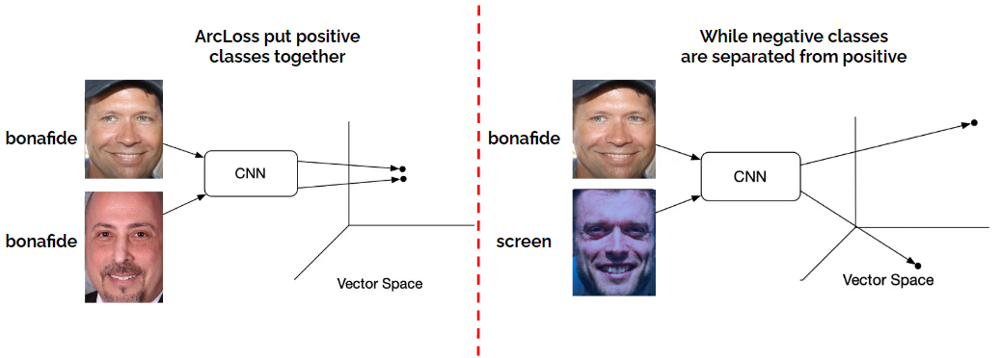
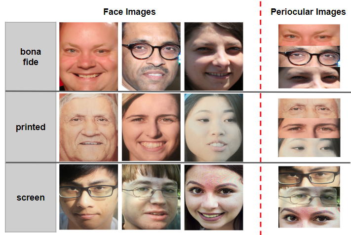

# PAD using Iris Periocular Visual Spectrum Images

This repository contains the code, datasets, and supplementary materials for the paper **"Presentation Attack Detection using Iris Periocular Visual Spectrum Images"** by Andrés Valenzuela, Juan E. Tapia, Violeta Chang, and Christoph Busch.

## Introduction

Presentation Attack Detection (PAD) is a critical challenge in biometric systems. This work explores the use of the periocular region instead of the full face for PAD tasks in the visual spectrum (RGB). Leveraging state-of-the-art Convolutional Neural Networks (CNNs) and innovative loss functions, such as ArcFace, we demonstrate the effectiveness of periocular-based PAD methods.

Key contributions include:
- A comparison of periocular and full-face PAD performance.
- Benchmarks with high-resolution datasets for PAD in the visual spectrum.
- Utilization of advanced CNN architectures and loss functions to enhance accuracy.

<div align="center">
    
</div>

## Database Description

We use two databases, **F-PAD** and **P-PAD**, which include high-resolution images of periocular regions and presentation attack examples. These databases were developed to address limitations in existing datasets, such as low quality and insufficient diversity in attack instruments.

### Databases Overview
<div align="center">

| **Database** | **Bona Fide** | **Printed Attacks** | **Screen Attacks** | **Total**  |
|:------------:|:-------------:|:-------------------:|:------------------:|:----------:|
| **F-PAD**    | 3,000         | 6,000               | 5,000              | 14,000     |
| **P-PAD**    | 5,200         | 10,000              | 9,998              | 25,198     |

</div>

- **F-PAD**: This dataset is publicly available upon request and can be used for research purposes.
- **P-PAD**: This dataset is private and was developed in collaboration with a biometric company. Access is restricted to approved researchers only.

### Example Images
Below are examples of the face and periocular images used in the study, including both bona fide and attack samples (printed and screen):

<div align="center">
  
</div>

For a detailed description of the preprocessing pipeline and dataset splits, refer to the **paper** or accompanying documentation.

## Citation

If you use this work in your research, please cite our paper:

```bibtex
@article{valenzuela2024pad,
  title={Presentation Attack Detection using Iris Periocular Visual Spectrum Images},
  author={Valenzuela, Andrés and Tapia, Juan E. and Chang, Violeta and Busch, Christoph},
  journal={Frontiers in Imaging},
  year={2024},
  volume={X},
  pages={XX--XX}
}
```

## Disclaimer
The datasets and code are provided for academic and research purposes only. Use of these materials must comply with ethical standards and applicable laws. Redistribution of datasets is prohibited without prior permission. While the F-PAD database is publicly accessible upon request, the P-PAD database remains private and requires special approval for use.

For dataset requests or more information, please contact us at andres.valenzuela.g@usach.cl or juan.tapia-farias@h-da.de.